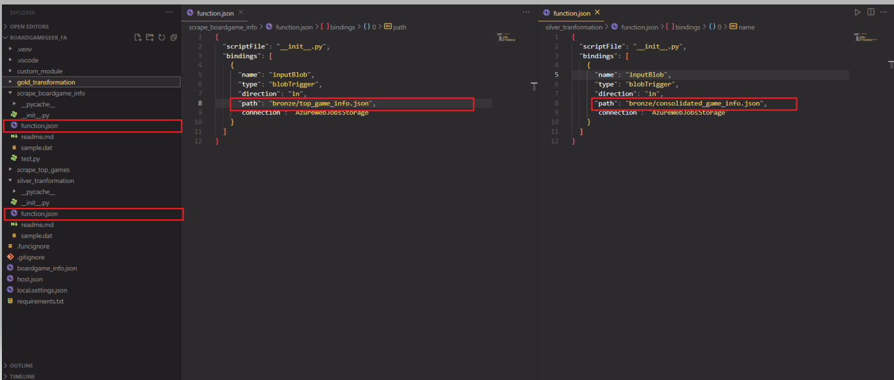

# BoardgameGeek Data Pipeline
<!-- Start Document Outline -->

* [BoardgameGeek Data Pipeline](#boardgamegeek-data-pipeline)
	* [Problem and Objective](#problem-and-objective)
	* [Architecture](#architecture)
		* [Overview](#overview)
		* [ETL Flow](#etl-flow)
		* [PowerBI Dashboard](#powerbi-dashboard)
	* [How to run](#how-to-run)
		* [Prerequisites](#prerequisites)
		* [Setting up Azure resources](#setting-up-azure-resources)
		* [Change local config settings in local.settings.json to fit your Azure resources](#change-local-config-settings-in-localsettingsjson-to-fit-your-azure-resources)
		* [Small warning](#small-warning)
		* [Test and debug our data pipeline](#test-and-debug-our-data-pipeline)

<!-- End Document Outline -->
## Problem and Objective
- As my boardgame group was browsing through a ton of articles to find a new game to play, I suddenly thought to myself why did we have to spend so much time to find something like this, there must be some tools or websites to help us right ?
- The first website came to my mind was BoardgameGeek, the page shows all information about every kind of boardgame. But its searching page (https://boardgamegeek.com/advsearch/boardgame) is quite bad and clunky.

-  Luckily for us, BoardgameGeek has API to get boardgame's data based on game's ID. So I decided to build a data pipeline to get/scrape their top games's data on this page (https://boardgamegeek.com/browse/boardgame) and save to Azure SQL DB

- The project focuses on using services provided by Microsoft Azure, I also build a PowerBI dashboard to visualize and help my group to find new boardgames
## Architecture
The pipeline consists of various modules and technologies
- **Microsoft Azure**: Azure function (orchestrating and running function), Azure Data Lake Storage (ADLS), Azure SQL Server Database
- **ADLS Module**: a class contains common function to help you interact with data in ADLS
- **PowerBI**: BI tool to help you connect and get data from Azure SQL Server DB for creating a interactive dashboard

### Overview
- Data is captured from the BoardgameGeek API using BGG XML API. The API documentation is available here: https://boardgamegeek.com/wiki/page/BGG_XML_API&redirectedfrom=XML_API#
- The collected data from the BoardgameGeek API is directly stored to the **Bronze** container on Azure Data Lake Storage (ADLS). ETL jobs and orchestration are written using Azure Function, **the whole data pipeline starts running when you trigger the HTTP of your Azure function**
### ETL Flow
- You trigger HTTP of `scrape_top_games.py` in Azure function to start a pipeline. The function will scrapes all top games of BoardgameGeek page, its parameters include: total_page and batch_size. 
    - **total_page** determines how many pages you want to scrape, each page has 100 games. 
    - **batch_size** determines how many games you want to scrape in 1 batch (highly recommend 20 or 50 for this parameter)
- `scrape_games_info.py` will be triggered after this to get detail information for each game. Then all batch data will be consolidated and saved to **Bronze** container
- Azure Function `silver_transformation` gets that data to clean and add more useful features. Then the function saves data to **Silver** container.
- Finally, Azure Function `gold_transformation` transforms data to fit business's requirements. In this case, the function creates master and bridge table and uploads it to Azure SQL Server DB. The CSV files containing master and bridge data will be saved to **Gold** container.

### Data Modeling and PowerBI Dashboard

## How to run
### Prerequisites
Install VS Code and its below extensions. 
- Azure Account
- Azure Function
- Azure Resources

You also have to install **Postman** to locally test and debug Azure Function 
### Setting up Azure resources
Create all resources below to prepare for the data pipeline
- 1 Azure Data Lake Storage account Gen 2 (ADLS) and 3 containers for our data layer: bronze, silver ,gold

- 1 SQL Server and 1 Database to store the data from
BoardgameGeek API

### Change local config settings in `local.settings.json` to fit your Azure resources
- ADLS connection string and key
- Data layer container's name in your ADLS
- Username and password of Azure SQL Server and Database

### Small warning
Every Azure function folder will have the structure like the image below
- `__init__.py` contains main code to execute
- `function.json` contains a function's settings include **binding**/**trigger**

As you can see, **scrape_games_info** will start when it detects the file **bronze/top_games_info.json** being uploaded to this ADLS path. So if you want to change the scrapping file's name in our main function, you also need to change this path accordingly

### Test and debug our data pipeline
Follow the path `src/py/` inside repo to open `boardgamegeek_fa` folder using VS code, then press F5 and run Postman to test the pipeline

=> After you've done with debug and testing, you can deploy the whole Azure Function project into cloud using **VScode** and run from there

